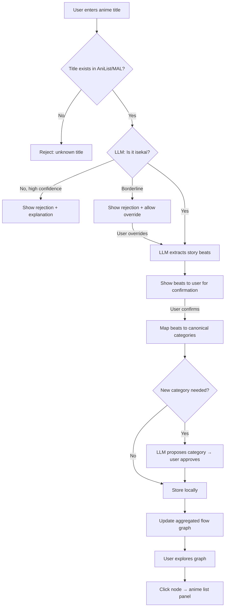

# Isekai Story Beat Analyzer

## Problem Frame

Isekai anime follow recognizable patterns in how their stories begin — death, reincarnation, summoning, divine encounters, power grants — but no tool maps these patterns across titles. An anime fan wants to see how different isekai openings diverge and converge, discover which anime share specific story beats, and explore the taxonomy of isekai beginnings as a visual graph.

## User Flow

## Requirements

**Analysis**

- R1. User submits an anime title via a text input
- R1a. The system validates the title against an external anime database (AniList or MAL API) before proceeding. Unknown titles are rejected.
- R2. Azure OpenAI (GPT-4.1-mini) determines whether the anime is isekai, returning a confidence score
- R3. If not isekai with high confidence, the system rejects with an explanation. If borderline (low confidence rejection), the user can override and proceed with analysis.
- R4. If isekai (or overridden), the LLM extracts the key story beats from the inciting incident through the first major milestone (5-10 beats), covering: how the protagonist leaves the original world, any transitional encounters (e.g., meeting a deity), how they arrive in the new world, what abilities or circumstances they receive, and their initial form/status in the new world
- R4a. Extracted beats are shown to the user for confirmation before persisting. The user can accept, reject, or re-analyze.
- R5. Each confirmed beat is mapped to a canonical beat category from the taxonomy

**Beat Taxonomy**

- R6. The system maintains a canonical taxonomy of beat categories organized by story stage. Each stage allows multiple beats per anime (a single anime can have multiple beats in any stage).
- R7. The taxonomy starts with the following predefined seed categories:

  | Stage | Seed Categories |
  |---|---|
  | Departure | death by vehicle, natural death, murdered, suicide, old age death, summoned by ritual, summoned as part of a group, logged into game, fell into portal |
  | Transition | meets deity/god, meets guide, reincarnation process, transported instantly, gradual realization |
  | Arrival | reborn as child, reborn as monster/non-human, arrives as adult, wakes in new body, starts in dungeon/wilderness, starts in town/city |
  | Powers | granted unique skill, granted mundane/weak power, retains past-life knowledge, given cheat-level power, no special ability, gains class/job system |

- R8. When the LLM encounters a beat that does not fit existing categories, it proposes a new category name. New categories are added to the taxonomy only after user confirmation.

**Visualization**

- R9. The primary view is an aggregated flow graph (DAG) where each node represents a canonical beat category and edges represent the progression from one beat to the next. The graph flows top-to-bottom, with each vertical level representing a story stage.
- R10. The graph aggregates all analyzed anime, showing how different isekai beginnings diverge and converge at shared beats
- R10a. Nodes are sized proportionally to the number of anime that pass through them, making dominant patterns immediately visible
- R11. Clicking a node opens a side panel listing all anime whose story passes through that beat
- R11a. Clicking an anime name in the side panel highlights that anime's full path through the graph, dimming all other paths
- R12. The graph updates when new anime are added
- R12a. The graph supports filtering by minimum anime count per node (hide rare paths) and by beat category name (focus on specific beats)
- R12b. The graph supports zoom and pan for navigation at scale

**Seeding**

- R13a. The system ships with a pre-analyzed seed dataset of 15-20 well-known isekai titles (mix of popular canonical titles and personal picks) so the graph is useful on first launch. This dataset also serves as a ground-truth validation set for LLM accuracy.

**Data**

- R13. Analyzed anime and their beat sequences are persisted in local storage (JSON or SQLite). The storage directory defaults to a `data/` folder within the repo but can be overridden via an environment variable.
- R14. The beat taxonomy is stored alongside the anime data and grows only through user-confirmed additions.
- R14a. When a user submits a title that already exists in the dataset, the system shows the cached result. No re-analysis option in MVP.
- R14b. Users can delete an analyzed anime from the dataset, which removes it from the graph.

**Error Handling**

- R15. When the Azure OpenAI API call fails (timeout, rate limit, service error), the system retries automatically with exponential backoff before surfacing an error to the user.

## Success Criteria

- A user can enter an anime title and receive a structured isekai analysis within seconds
- The flow graph accurately shows shared beats across 10+ anime
- Clicking any node reveals which anime share that story beat
- Non-isekai anime are correctly rejected with a clear explanation
- Pre-seeded dataset of 15-20 isekai makes the graph useful on first launch
- LLM-extracted beats for seed dataset match manually verified ground truth

## Scope Boundaries

- Personal tool — no authentication, multi-user, or community features
- Analysis covers the story beginning only (inciting incident through first major milestone), not full plot
- No anime metadata beyond what is needed for the analysis (no ratings, episode counts, etc.)
- No anime recommendation engine — this is an analysis and visualization tool

## Key Decisions

- **LLM-powered analysis with user confirmation**: The LLM generates beat extraction automatically; user confirms beats before persisting to prevent hallucination
- **Controlled taxonomy growth**: Start with predefined categories; the LLM can propose new categories but they require user approval before being added
- **DAG flow graph over parallel timelines**: An aggregated directed graph where anime converge at common beats is more insightful than isolated per-anime timelines
- **Local storage over cloud DB**: Local JSON/SQLite with configurable storage path — proportionate infrastructure for a personal tool
- **Title validation via external API**: AniList/MAL validation prevents the LLM from hallucinating about nonexistent anime
- **Confidence-based isekai classification**: Borderline cases get a confidence score and user override rather than hard rejection
- **Pre-seeded dataset**: Ship with 15-20 pre-analyzed popular isekai so the graph is interesting on day one

## Dependencies / Assumptions

- Azure OpenAI deployment with GPT-4.1-mini access
- AniList or MyAnimeList API access for title validation
- The LLM has sufficient knowledge of anime titles and their plots to perform accurate beat extraction (mitigated by title validation and user confirmation of beats)

## Outstanding Questions

### Resolve Before Planning

*None — all product decisions resolved.*

### Deferred to Planning

- [Affects R9][Needs research] Which graph visualization library best supports interactive DAG rendering with click-to-inspect, zoom/pan, and node sizing? (e.g., D3, React Flow, Cytoscape)
- [Affects R5, R8][Technical] How should the LLM prompt be structured to reliably map beats to canonical categories (with multi-select per stage) and propose new ones?
- [Affects R13][Technical] Local storage schema design — JSON file structure or SQLite schema for anime, beats, and taxonomy
- [Affects R1a][Technical] AniList vs MAL API — which is better for title validation? Rate limits, data coverage, ease of integration
- [Affects R9, R10][Technical] Frontend framework selection — assess what fits best for graph-heavy interactive UIs
- [Affects R13a][Technical] Which 15-20 isekai titles should be in the seed dataset? Manual beat authoring or LLM-generated with manual verification?

## Next Steps

→ `/ce-plan` for structured implementation planning
